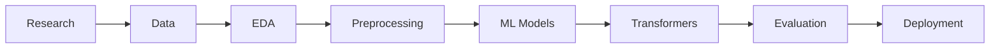

# Hey, I'm Chandan Kumar Mahato 👋

### AI/ML Enthusiast · B.Tech CSE Student · Aspiring AI/ML Systems Engineer

I enjoy understanding how intelligent systems work — from **algorithms and data to machine learning models and production systems**.

[](https://github.com/chandannmahatoo)
[](https://www.linkedin.com/in/chandanmahat07/)
[](https://leetcode.com/u/chandannmahatoo/)

---

## 👨‍💻 About Me

- 🎓 B.Tech Computer Science Engineering student
- 🤖 Exploring **AI/ML Systems Engineering**
- 🐍 Working with **Python, Machine Learning & Data Analysis**
- 💻 Strengthening **DSA & problem solving with C++**
- 🔬 Interested in **NLP, Deep Learning & AI Systems**
- 🏗️ I enjoy building projects from **first principles to deployment**

> **Learn → Understand → Experiment → Build → Improve**

---

## 🚀 Currently Working On

### 🤖 AI-Based Sentiment Analysis System

Building an **end-to-end NLP system** with my team to analyze textual sentiment using classical ML and transformer-based approaches.

**My Focus:** `Research` · `EDA` · `Preprocessing` · `Model Development` · `Evaluation`



**Tech:** `Python` · `Pandas` · `NumPy` · `Scikit-learn` · `NLP` · `Transformers`

> 🚧 **Status:** Active Development

---

## 🛠️ Tech Stack

### Languages


### AI / ML & Data


### Tools


---

## 📂 Featured Projects

### 🤖 AI-Based Sentiment Analysis
End-to-end NLP system exploring **classical ML and transformer models** for sentiment classification.

`Python` `NLP` `Scikit-learn` `Transformers` `EDA`

### 🏫 CAMPUSFLOW
AI-assisted campus issue management system for **classification, prioritization, duplicate detection, and intelligent routing**.

`React` `FastAPI` `PostgreSQL` `AI/ML`

### 📐 Calculus Visualizer
Interactive project for understanding **single-variable calculus computationally from first principles**.

`Mathematics` `Programming` `Visualization`

---

## 📚 Currently Learning

```text
DSA & C++
    ↓
Python & Data Analysis
    ↓
Machine Learning
    ↓
Deep Learning & NLP
    ↓
AI/ML Systems Engineering
```

Currently exploring:

`DSA` · `Machine Learning` · `NLP` · `Transformers` · `AI Systems` · `MLOps`

---

## 🧩 DSA & Problem Solving

Strengthening **C++ + DSA + Algorithmic Problem Solving** through consistent practice.

**Current Focus:**  
`Arrays` · `Sorting` · `Binary Search` · `Vectors` · `Two Pointers` · `Bit Manipulation`

[](https://leetcode.com/u/chandannmahatoo/)

---

## 🏆 Hackathons & Collaboration

Interested in **Hackathons · AI Competitions · Open Source · Research · Engineering Projects**

### PRAGYAX

Building and learning with my team through:

**Learn → Experiment → Build → Compete → Analyze → Improve**

---

## 📊 GitHub Stats

<p align="center">
  
  
</p>

---

## 🎯 Long-Term Direction

**AI/ML Systems Engineering**

I'm interested in understanding the complete AI stack:

`Mathematics` → `Algorithms` → `ML Models` → `AI Systems` → `Infrastructure` → `Production`

---

## 🤝 Connect With Me

[](https://github.com/chandannmahatoo)
[](https://www.linkedin.com/in/chandanmahat07/)
[](https://leetcode.com/u/chandannmahatoo/)

---

<p align="center">
  <b>Understand deeply. Build deliberately. Improve continuously.</b>
</p>

<p align="center">
  Building toward AI/ML Systems Engineering — one concept and project at a time.
</p>
